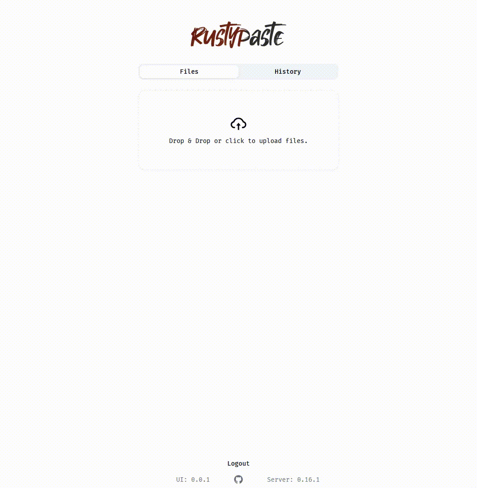
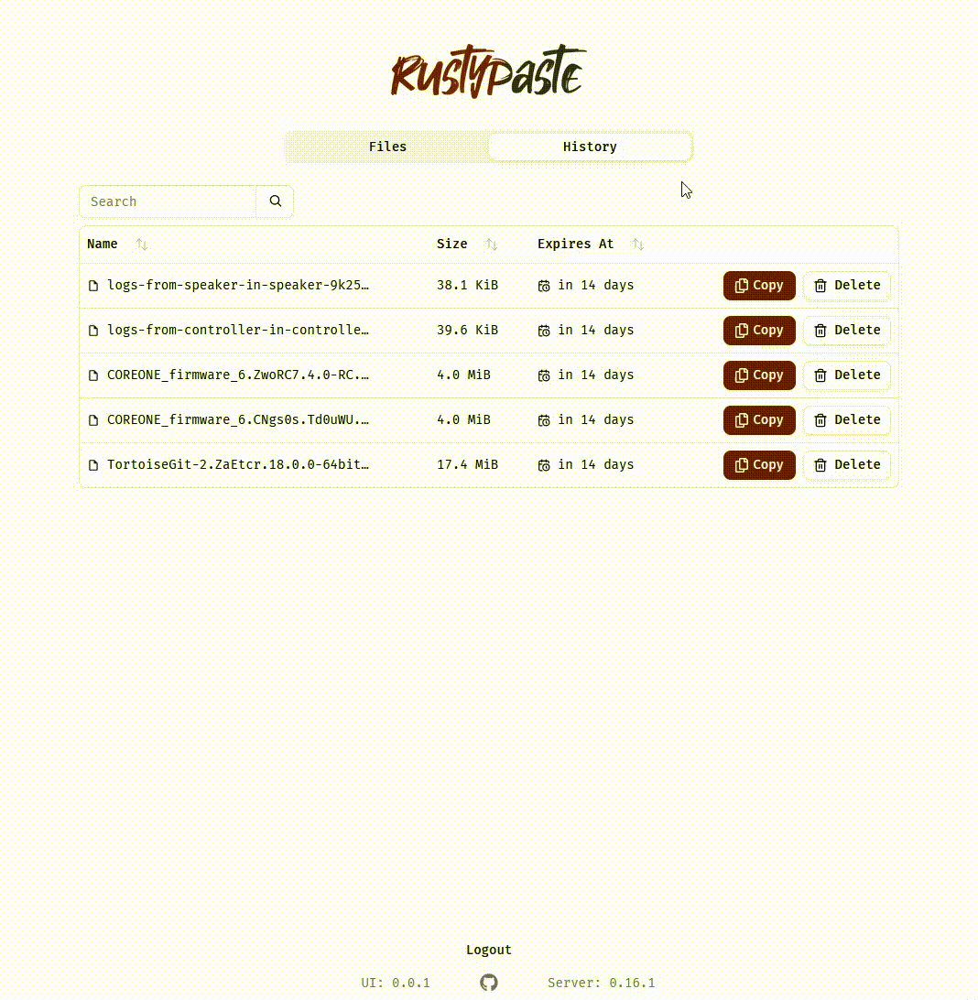

# rustypaste-ui

A (future) fully-functional UI for Rustypaste.


**Current features:**

- A single file with no external dependencies.
- Responsive (desktop + mobile).
- Authentication via tokens stored in local storage.
- Drag and drop uploading of local files with progress (uses the default expiration of the server).

## Installation

All dependencies are bundled into a single html file to be served directly by
the [rustpaste](https://github.com/orhun/rustypaste) server. Download the lastest release published using:

```shell
curl \
  --output index.html \
  --location \
  --clobber \
  https://github.com/Silvenga/rustypaste-ui/releases/latest/download/index.html
```

Make sure to configure the server to serve this file as the default page.
For future completeness, also make sure version and listing is enabled too.

```toml
[landing_page]
file = "index.html"
content_type = "text/html; charset=utf-8"

[server]
expose_version = true
expose_list = true
```

Right now, the UI assumes the same token can both upload and delete uploads.

## Demos




